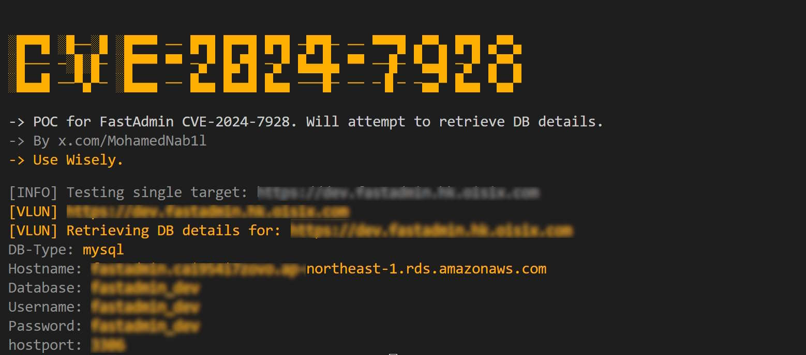

# CVE-2024-7928
POC for CVE-2024-7928. Will attempt to retrieve DB details for FastAdmin instances.


## Overview

This is a bulk scanning and exploitation tool for CVE-2024-7928: FastAdmin up to 1.3.3.20220121 allows unauthenticated attackers to execute a directory traversal. This tool is based on this [Security Research](https://wiki.shikangsi.com/post/share/da0292b8-0f92-4e6e-bdb7-73f47b901acd).

## How to Use

### Install the script requirements:
```sh
pip install -r requirements.txt
```

### Single Target:
```sh
python CVE-2024-7928.py -u https://target:9090
```

### Bulk Sscan:
```sh
python CVE-2024-7928.py -f file.txt
```

## Contact

For any suggestions or thoughts, please get in touch with [me](https://x.com/MohamedNab1l).


## Disclaimer

I like to create my own tools for fun, work and educational purposes only. I do not support or encourage hacking or unauthorized access to any system or network. Please use my tools responsibly and only on systems where you have clear permission to test.

## References

- https://nvd.nist.gov/vuln/detail/CVE-2024-7928
- https://vuldb.com/?id.275114
- https://wiki.shikangsi.com/post/share/da0292b8-0f92-4e6e-bdb7-73f47b901acd
